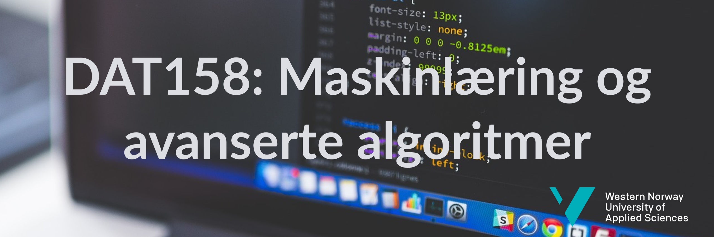

# DAT158ML
Her finner du kode og dokumentasjon til DAT158-ML ved HVL. 

# Installasjon
Vi anbefaler at du installerer Python ved å bruke [Anaconda](https://www.anaconda.com/distribution). Gå deretter gjennom følgende steg: 
### Last ned repoet: 
```bash
git clone https://github.com/alu042/DAT158ML
cd DAT158ML
```
### Sett opp omgivelser
```bash
conda env update
```

### Aktiver omgivelsene:
```bash
conda activate dat158
```
(eller `source activate dat158` om kommandoen feiler)

### Installer Jupyter-kjerne
```bash
python -m ipykernel install --user --name dat158 --display-name "DAT158"
```

### Test installasjonen
Gå gjennom notebooken `1.0-test.ipynb`:
```bash
jupyter notebook
```

## Oppdatering
Oppdater kode: `git pull`. 
Oppdater pakker: `conda env update`.


